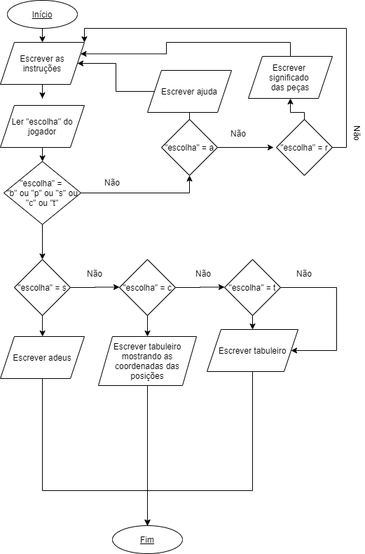

# Basic_Loureiro

- Funcionamento do programa:

No início é perguntado se o jogador deseja jogar com brancas, pretas ou se ele deseja sair. Enquanto a resposta não for a esperada o programa continua perguntando isso. Quando está escolhido as peças, o programa mostra o tabuleiro e fecha. O jogador ainda pode pedir ajuda, na qual o programa mostra as instruções. Ele pode pedir também para saber o significado dos símbolos de cada peça. 

- Fluxograma:

- Screenshot do programa:

 - [Código](https://github.com/ProgramacaoEE2020/BASIC_Loureiro/blob/master/Código/Loureiro_Código_MSX_Basic.bas)
